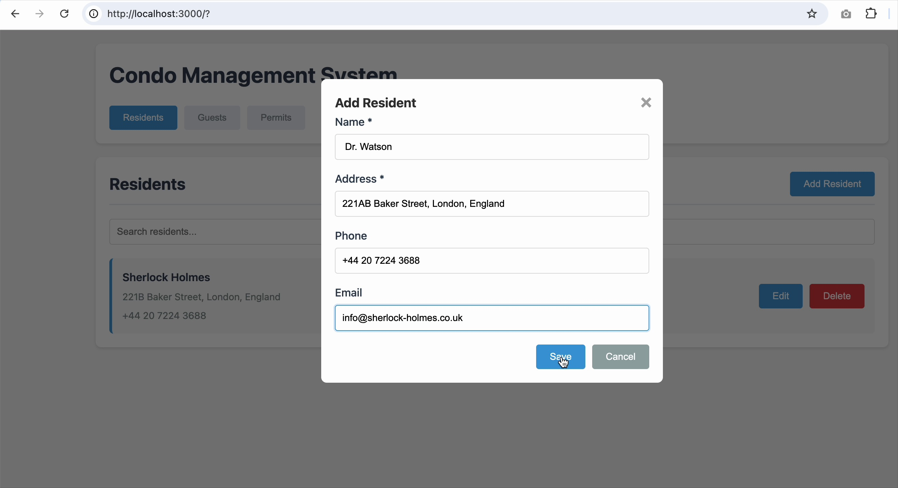

# Condo Management System - Specifications

This repository contains **feature specifications** for the Condo Management System.

A complete web application that helps condo managers and residents track residents, register guests, manage vehicle parking, and generate printable parking permits—all through an intuitive web interface. You are expected to generate the implementation code yourself using the tech stack you're most familiar with, using AI vibe coding tools like Cursor.

## 💡 Why No Implementation Code?

This repository represents a **paradigm shift in software development** - we focus on **what customers and users need** instead of **how to implement it**.

This repository intentionally contains **only specifications** to:

1. **Customer-First Development**: Focus on user requirements and business value, not technical implementation details
2. **AI-Powered Implementation**: Let AI handle the "how" while humans focus on the "what" and "why"
3. **Reduce Repository Size**: No compiled code or dependencies cluttering the repository
4. **Version Control Clarity**: Only the source of truth (specs) are tracked, not generated artifacts

The complete application (backend, frontend, database, Docker configs) will be generated when you build from these specs using AI assistance.

## 🎯 Purpose

This repository provides **ready-to-build specifications** for a complete **Condo Management System**. Using [GitHub Spec-Kit](https://github.com/github/spec-kit) and AI assistance, you can generate a fully-functional web application that manages residents, guests, vehicles, and parking permits—complete with a modern UI, REST API, database, and comprehensive test coverage. Simply run a few commands and watch the entire application build itself from the specifications.



This is what the built application looks like and what you can expect after running `/implement`.

## 📋 Features Overview

The Condo Management System includes:

- **Resident Management**: Add, edit, delete residents with contact information and multiple vehicles
- **Guest Registration**: Register temporary guests with customizable parking permit validity periods
- **Vehicle Management**: Track multiple vehicles per resident and guest
- **Parking Permit Generation**: Create and print parking permits for guest vehicles
- **Modern Web Interface**: Responsive design with embedded status notifications (no popups)
- **REST API**: Complete backend with OpenAPI documentation
- **Database**: SQLite with proper migrations and schema
- **Testing**: Comprehensive test coverage following TDD principles
- **Accessibility**: ARIA support and keyboard navigation

**Tech Stack**: These specs use Rust (Axum), SQLite, and vanilla JavaScript, but you can generate the code using any stack you're more familiar with by specifying it during the `/plan` step.

### Explore Current Specifications

To understand what you'll be building, explore the current specifications:
- **Main Application**: [`specs/001-build-app-with/spec.md`](specs/001-build-app-with/spec.md) - Core condo management features
- **Status Notifications**: [`specs/002-do-not-show/spec.md`](specs/002-do-not-show/spec.md) - Enhanced UX without popups

Each spec file contains detailed requirements, user stories, and acceptance criteria that will guide the implementation.

## 🚀 How to Build the Project

### Prerequisites

1. **Install Cursor IDE**:
   - Download from [cursor.sh](https://cursor.sh)
   - Install Cursor on your system

2. **Clone the Repository**:
   ```bash
   git clone https://github.com/aospan/condo-manager.git
   cd condo-manager
   ```

3. **Open in Cursor IDE**:
   - Open Cursor application
   - Use File > Open Folder and select the `condo-manager` directory

Note: The Spec-Kit framework (`.specify/` and `.cursor/` directories) is already included. See `SETUP.md` for updating to the latest version from [github.com/github/spec-kit](https://github.com/github/spec-kit).

### Building All Features

1. **Generate Implementation Plans**:
   - In Cursor IDE, open the chat window (Cmd/Ctrl+L)
   - Type: `/plan`
   - Review the generated implementation plan

2. **Implement All Features**:
   - In Cursor IDE chat window:
   - Type: `/implement`
   - Cursor will build the complete application with all features
   - This generates all backend code, frontend code, database, configs, and tests

3. **Start the Application**:
   - Simply ask Cursor in plain English: "start application"
   - Cursor will run the appropriate commands (docker-compose, cargo run, etc.)

4. **Access and Test**:
   - Open browser to `http://localhost:3000`
   - Test resident management, guest registration, parking permits
   - Verify embedded status messages (no popup dialogs!)

🎉 **Congratulations!** You now have a fully functional Condo Management System. Poke around, explore the features, and feel free to add your own requirements to customize the system to your specific needs using the `/specify` command in Cursor IDE.

## 🛠️ Spec-Kit Framework

The Spec-Kit framework ([GitHub Spec-Kit](https://github.com/github/spec-kit)) provides:

**Custom Commands** (in Cursor IDE):
- `/specify <description>` - Create a new feature specification
- `/clarify` - Resolve ambiguities in specifications
- `/plan` - Generate implementation plan with design docs
- `/tasks` - Generate detailed task list
- `/implement` - Execute implementation following TDD

**Workflow**:
```
User Idea → /specify → spec.md → /plan → design docs → /implement → Working Code
```

## 📖 Example: Adding a New Feature

1. **In Cursor IDE chat window**, describe your feature:
   ```
   /specify add email notifications when guest permits expire
   ```

2. **Review and clarify** the generated spec:
   ```
   /clarify
   ```
   Answer questions about notification requirements

3. **Generate implementation plan**:
   ```
   /plan
   ```

4. **Review the plan, then implement**:
   ```
   /implement
   ```

**Result**: Fully implemented email notification feature!

## 🔍 Spec File Contents

Each feature specification includes:

1. **spec.md**: Business requirements, user stories, acceptance criteria
2. **plan.md**: Technical approach, architecture decisions
3. **research.md**: Technology choices and trade-offs
4. **data-model.md**: Entities, relationships, validation rules
5. **contracts/**: API specifications (OpenAPI/GraphQL schemas)
6. **tasks.md**: Ordered implementation tasks (50-100 tasks)
7. **quickstart.md**: Testing scenarios and validation steps

## 🎓 Benefits of This Approach

✅ **Reproducible**: Anyone can build the same application from specs  
✅ **Documented**: Every decision is explained and justified  
✅ **Testable**: Tests are written before implementation (TDD)  
✅ **Maintainable**: Clear architecture and design patterns  
✅ **Educational**: Learn by seeing specs → plans → implementation  
✅ **Collaborative**: Specs can be reviewed before coding begins  


## 🔧 Features Overview

### After Building Feature 001

You'll have a fully functional condo management system with:

- **Resident Management**: Add, edit, delete resident information
- **Guest Registration**: Register guests with validity periods
- **Vehicle Management**: Track vehicles for residents and guests
- **Parking Permits**: Generate and print parking permits for guests
- **REST API**: Complete OpenAPI-documented API
- **Database**: SQLite with proper migrations
- **Tests**: Comprehensive test coverage (unit, integration, E2E)

### After Building Feature 002

Enhanced UX with:

- **Status Notifications**: Embedded messages instead of popup dialogs
- **Auto-Dismiss**: Messages disappear after 5 seconds
- **Accessibility**: WCAG 2.1 AA compliant
- **Keyboard Navigation**: Escape key to dismiss, Tab navigation
- **Multiple Types**: Success, error, info, and warning messages

## 🤝 Contributing

To add a new feature:

1. Use `/specify <your feature idea>` in Cursor IDE
2. Review and refine the generated spec
3. Run `/plan` to create implementation plan
4. Submit spec for review (before implementing)
5. Run `/implement` to build the feature

## 📚 Learn More

- Understand Spec-Kit: [github.com/github/spec-kit](https://github.com/github/spec-kit)
- Review Feature 001 spec: `specs/001-build-app-with/spec.md`
- Review Feature 002 spec: `specs/002-do-not-show/spec.md`

## 📄 License

This project is licensed under the MIT License.

---

**Note**: This repository demonstrates specification-driven development with AI assistance using [GitHub Spec-Kit](https://github.com/github/spec-kit). The specifications are complete and ready to be implemented using the `/plan` and `/implement` commands in Cursor IDE.
